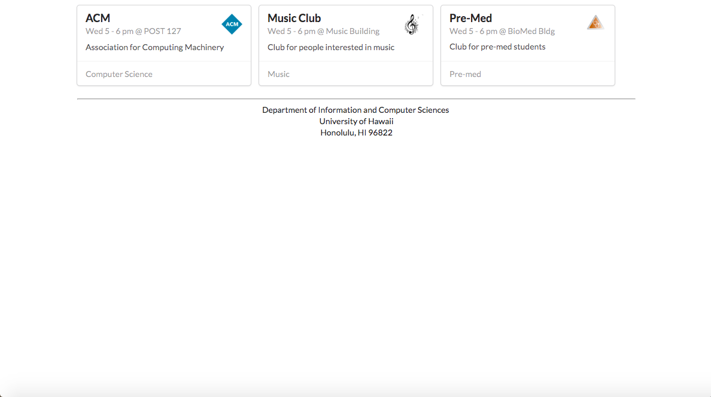
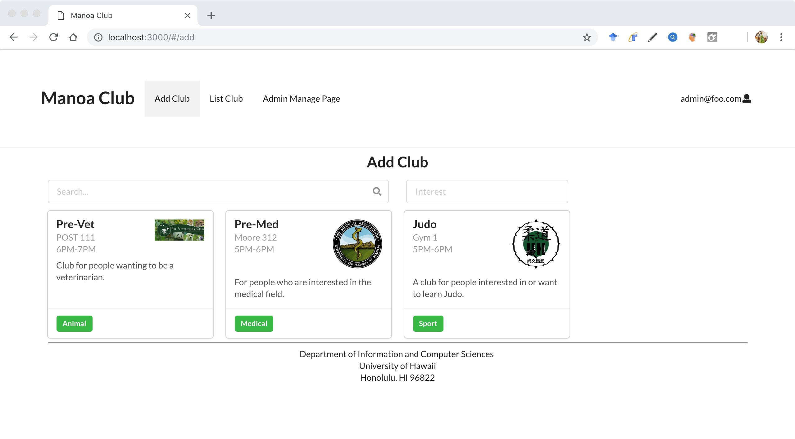
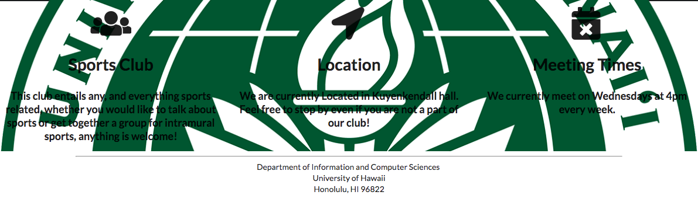
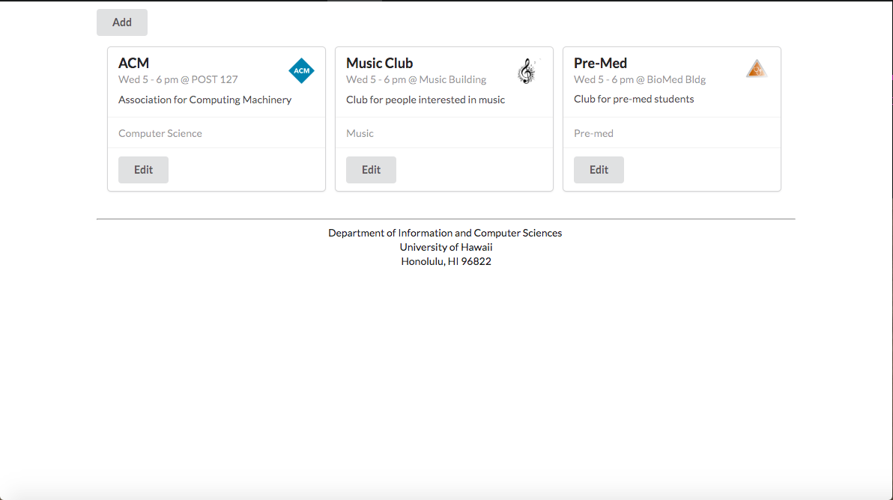

# Table of contents

* [About ManoaClubRoom](#about-manoa-club-room)
* [About the Team](#about-the-team)
* [Installation](#installation)
* [Application design](#application-design)
  * [Directory structure](#directory-structure)
  * [Import conventions](#import-conventions)
  * [Naming conventions](#naming-conventions)
  * [Data model](#data-model)
  * [CSS](#css)
  * [Routing](#routing)
  * [Authentication](#authentication)
  * [Authorization](#authorization)
  * [Configuration](#configuration)
  * [Quality Assurance](#quality-assurance)
* [Development history](#development-history)
  * [Milestone 1](#milestone-1-mockup-development)
  * [Milestone 2](#milestone-2-data-model-development)
  * [Milestone 3](#milestone-3-connect-ui-to-data-model)

# About Manoa Club Room 

link: [http://manoaclubroom.meteorapp.com/#/](http://manoaclubroom.meteorapp.com/#/)

The Manoa Club Room application will provide a centralized directory for UH Manoa student clubs. UH Manoa students can login to browse a well organized directory of all current student clubs, with brief descriptions, meeting times and locations, URLs to their websites (if any), contact information for officers, and a few select photos.

# About the Team

Bailey Borengasser

Julie Chai

Alexander Duong

Edward Yi

Xue Gong (Kristi)

# Installation
1. [Install Meteor](https://www.meteor.com/install).

2. [Download a copy of ManoaClubRoom](https://github.com/manoaclubroom/manoaclubroom) or clone it using git.
  
3. cd into the app/ directory and install libraries with:

```
$ meteor npm install
```

4. Run the system with:

```
$ meteor npm run start
```

The application should appear at [http://localhost:3000](http://localhost:3000).

# Application Design

## Directory structure


## Import conventions

## Naming conventions


## Data model
We are currently using Club and User as our Javascript data model. It uses the MongoDB collection that will export a variable that will provide access to the collection.

## CSS

## Routing
Navigation of between pages is done using Router from React Router.

## Authentication

## Authorization
The landing, sign in, and sign up are pages with public access, everyone can access it.

However, the other pages are not visible unless the user has a certain role or they are the owner, and they are logged into their account. This is to prevent any user from accessing any page that they want to, without permission, and keep a users profile to its registered account.

Authorization is done through role assignment to accounts, User having the lowest access, Admin the highest, and Club Admin as the second highest. With roles, we also prevent items from appearing on the navbar and users that know the page address to reach these pages will be stopped by checks that make sure they are logged in and has access with their current role.

## Configuration

## Quality Assurance

### ESLint
The application includes a .eslintrc file is used to define the coding style used in this application.

### Data model unit tests

### JSDoc

# Development History

## Milestone 1

Mockup landing page sketch:


Mockup user home page sketch:


Mockup admin home page sketch:


Mockup club admin home page sketch:


Mockup browse club page sketch:


landing page:


user home page:



search club page:



club admin home page:



admin home page:




## Milestone 2

## Milestone 3
