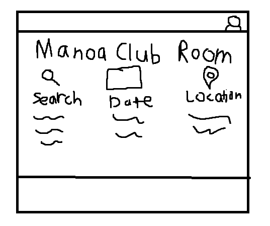
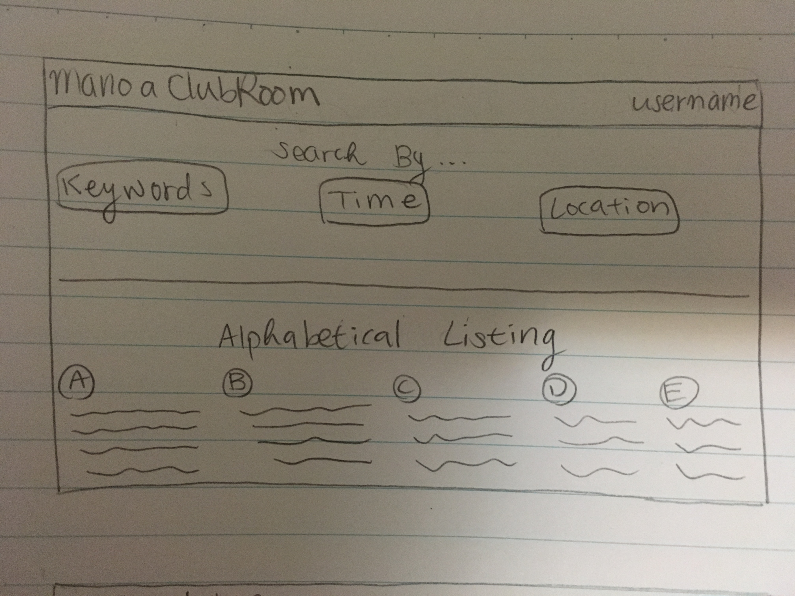
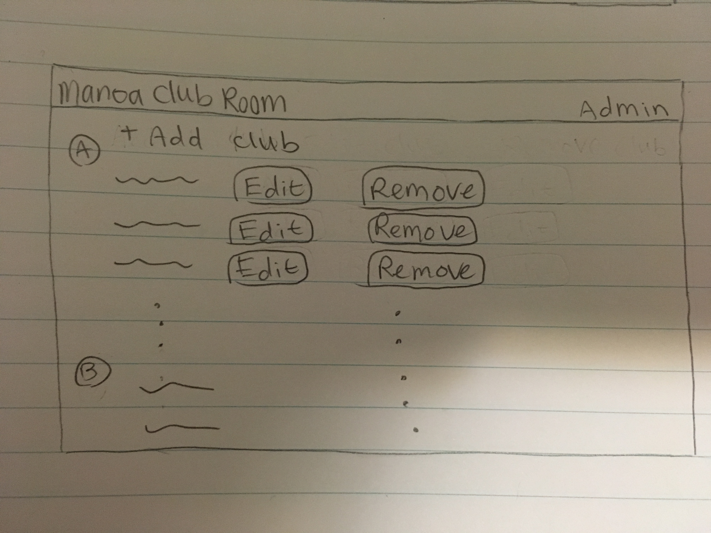
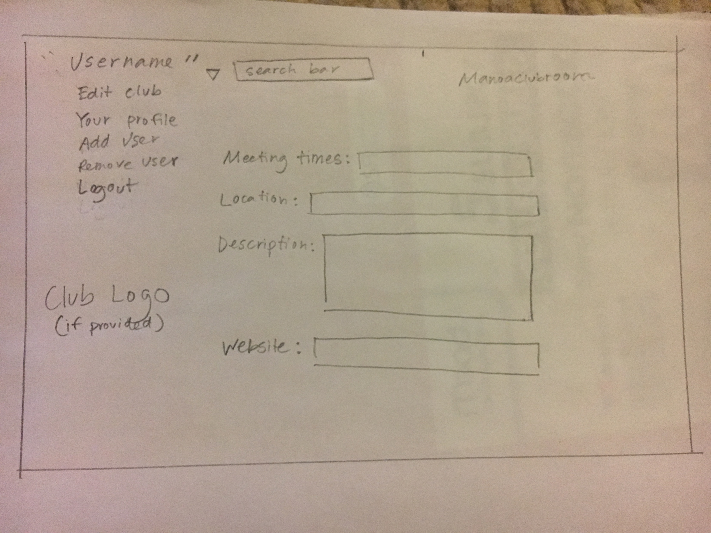
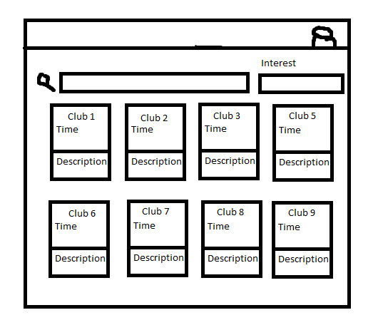

# Table of contents

* [About ManoaClubRoom](#about-manoa-club-room)
* [About the Team](#about-the-team)
* [Installation](#installation)
* [Application design](#application-design)
  * [Directory structure](#directory-structure)
  * [Import conventions](#import-conventions)
  * [Naming conventions](#naming-conventions)
  * [Data model](#data-model)
  * [CSS](#css)
  * [Routing](#routing)
  * [Authentication](#authentication)
  * [Authorization](#authorization)
  * [Configuration](#configuration)
  * [Quality Assurance](#quality-assurance)
* [Development history](#development-history)
  * [Milestone 1](#milestone-1-mockup-development)
  * [Milestone 2](#milestone-2-data-model-development)
  * [Milestone 3](#milestone-3-connect-ui-to-data-model)
  * [Milestone 4](#milestone-4-authentication)
  * [Milestone 5](#milestone-5-administration)
* [Walkthrough videos](#walkthrough-videos)
* [JSDocs](/jsdocs)

# About Manoa Club Room 

The Manoa Club Room application will provide a centralized directory for UH Manoa student clubs. UH Manoa students can login to browse a well organized directory of all current student clubs, with brief descriptions, meeting times and locations, URLs to their websites (if any), contact information for officers, and a few select photos.

# About the Team

Bailey Borengasser

Julie Chai

Alexander Duong

Edward Yi

# Installation
1. [Install Meteor](https://www.meteor.com/install).

2. [Download a copy of ManoaClubRoom](https://github.com/manoaclubroom/manoaclubroom) or clone it using git.
  
3. cd into the app/ directory and install libraries with:

```
$ meteor npm install
```

4. Run the system with:

```
$ meteor npm run start
```

The application should appear at [http://localhost:3000](http://localhost:3000).

# Application Design

## Directory structure

## Import conventions

## Naming conventions

## Data model

## CSS

## Routing

## Authentication

## Authorization

## Configuration

## Quality Assurance

### ESLint

### Data model unit tests

### JSDoc

# Development History

## Milestone 1

Mockup landing page sketch:



Mockup user home page sketch:



Mockup admin home page sketch:



Mockup club admin home page sketch:



Mockup browse club page sketch:



## Milestone 2

## Milestone 3

## Milestone 4

## Milestone 5
