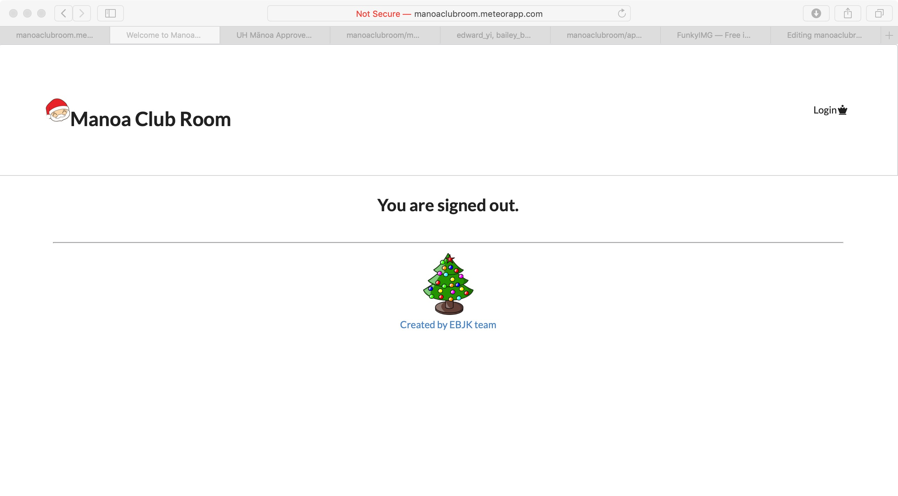

# Table of contents

* [About ManoaClubRoom](#about-manoa-club-room)
* [User Guide](#user-guide)
* [The Team](#the-team)
* [Installation](#installation)
  * [Data model](#data-model)
  * [Routing](#routing)
  * [Authorization](#authorization)
* [Development history](#development-history)
  * [Milestone 1: Mockup Devlopment](#milestone-1-mockup-development)
  * [Milestone 2: Functionality Implementation](#milestone-2-data-model-development)
  * [Milestone 3: Beyond The Basics](#milestone-3-connect-ui-to-data-model)

# About Manoa Club Room 

link: [http://manoaclubroom.meteorapp.com/#/](http://manoaclubroom.meteorapp.com/#/)

The Manoa Club Room application will provide a centralized directory for UH Manoa student clubs. UH Manoa students can login to browse a well organized directory of all current student clubs, with brief descriptions, meeting times and locations, URLs to their websites (if any), contact information for officers, and a few select photos.

# User Guide

All users can register/login, search for clubs by interests, and make and view their profile.
Club admins can also edit their clubs.
Super admins can also add clubs.

# The Team

Bailey Borengasser

Julie Chai

Alexander Duong

Edward Yi

Xue Gong (Kristi)

# Installation
1. [Install Meteor](https://www.meteor.com/install).

2. [Download a copy of ManoaClubRoom](https://github.com/manoaclubroom/manoaclubroom) or clone it using git.
  
3. cd into the app/ directory and install libraries with:

```
$ meteor npm install
```

4. Run the system with:

```
$ meteor npm run start
```

The application should appear at [http://localhost:3000](http://localhost:3000).

## Data model
We are currently using Club and User as our Javascript data model. It uses the MongoDB collection that will export a variable that will provide access to the collection.

## Routing
Navigation of between pages is done using Router from React Router.

## Authorization
The landing, sign in, and sign up are pages with public access, everyone can access it.

However, the other pages are not visible unless the user has a certain role or they are the owner, and they are logged into their account. This is to prevent any user from accessing any page that they want to, without permission, and keep a users profile to its registered account.

Authorization is done through role assignment to accounts, User having the lowest access, Admin the highest, and Club Admin as the second highest. With roles, we also prevent items from appearing on the navbar and users that know the page address to reach these pages will be stopped by checks that make sure they are logged in and has access with their current role.

### ESLint
The application includes a .eslintrc file is used to define the coding style used in this application.

# Development History

## Milestone 1: Mockup Development

Github project page: https://github.com/manoaclubroom/manoaclubroom/projects/1

Our main goal for Milestone 1 was to complete mockup designs for our Manoa Club Room application. We used Semantic UI React within a Meteor application to get the process started. At this point in the Milestone only the front-end was implemented. You can see our designs in the pictures below.

Mockup landing page sketch:


Mockup user home page sketch:


Mockup admin home page sketch:


Mockup club admin home page sketch:


Mockup browse club page sketch:


## Milestone 2: Functionality Implementation

Github project page: https://github.com/manoaclubroom/manoaclubroom/projects/2

In Milestone 2 we were able to implement basic functionality. With the default accounts we have made we are able to navigate to and from the pages below.

Landing page:


Edit club page:


Add club page:


Admin home page:


Club admin home page:


Make user profile page:


User profile page:


## Milestone 3

Github project page: https://github.com/manoaclubroom/manoaclubroom/projects/3

Milestone 3 began on November 30th 2018

The goal of Milestone 3 was to complete all functionality for our app. 

Landing page with the Christmas theme


Edit club page:


Request club page:


Signout page:



Interest club page:


list clubs page:


User profile page:


Community Feedback:

1) "I like that the website is minimalistic in design yet sophisticated. The search function is nice because it lets you filter through all the clubs and look for the one you want."

2) "I think the descriptions should be more brief and distinguishable from the background. Especially the left text is a little hard to read. Maybe, text should have shadows?"

